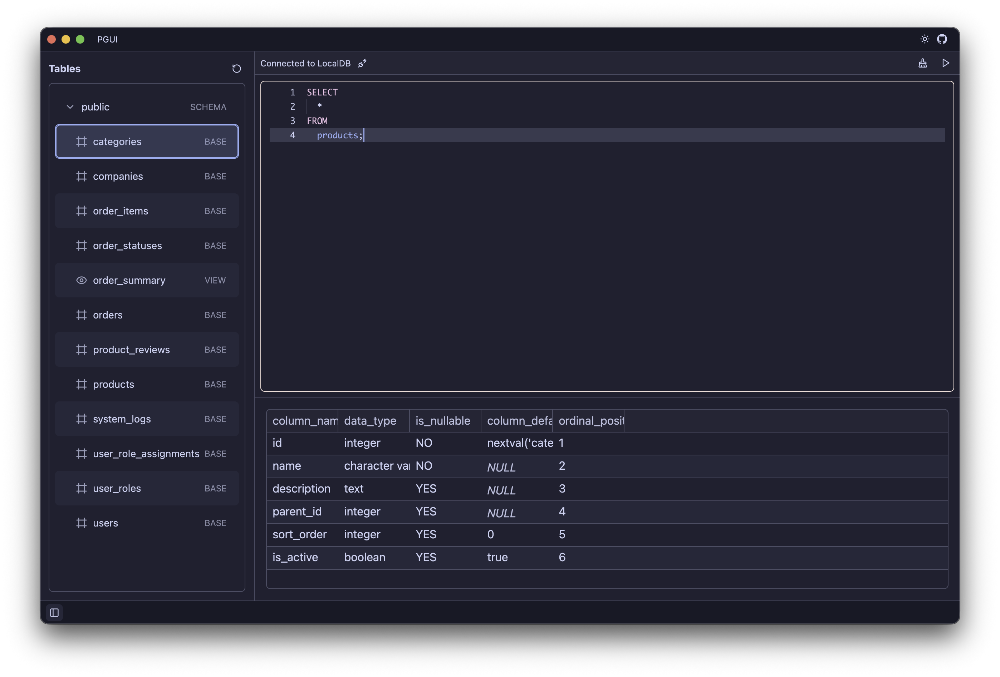

# PGUI

A high performance GUI to query & manage postgres databases.

Written in [GPUI](https://gpui.rs) with [GPUI Component](https://github.com/longbridge/gpui-component)

### Saved Connections

Connections will be saved to a sqlite db file in `~/.pgui/connections.db`

Passwords are saved in the host OS secure store via Keyring.rs.

As of 2025-11-17:

See [Mac App Build](./MAC_APP_BUILD.md) for building locally on MacOS
