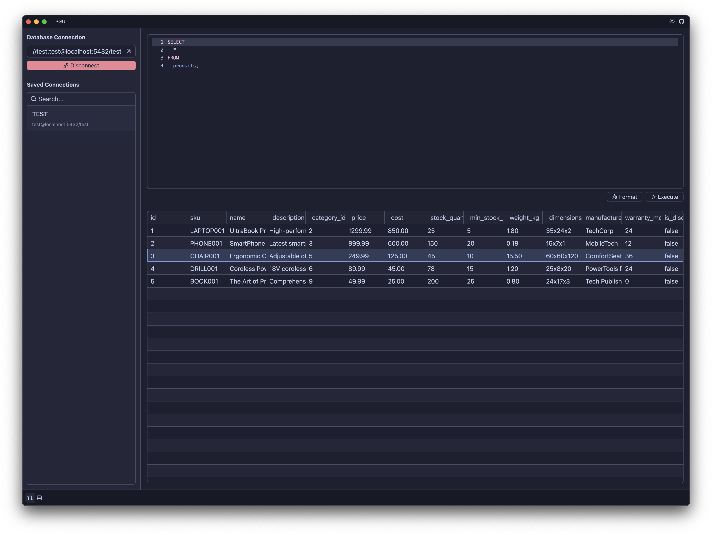

# PGUI

A GUI to query & manage postgres databases.

Written in [GPUI](https://gpui.rs) and [GPUI Component](https://github.com/longbridge/gpui-component)

### Saved Connections

For now, any connections stored in `<HOME_DIR>/.pgui/connections.json` will be picked up.

Example:
```json
[
  {
    "id": 1,
    "name": "TEST",
    "hostname": "localhost",
    "port": 5432,
    "database": "test",
    "username": "test",
    "password": "test"
  }
]
```

As of 2025-07-30:


