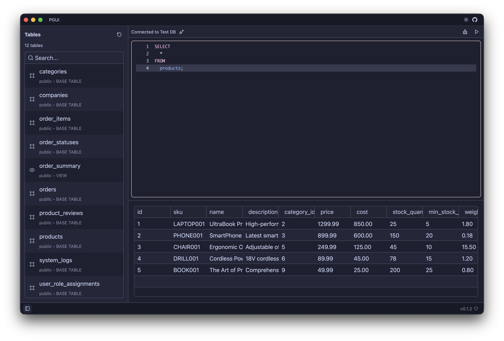

# PGUI

A GUI to query & manage postgres databases.

Written in [GPUI](https://gpui.rs) and [GPUI Component](https://github.com/longbridge/gpui-component)

### Saved Connections

Connections will be saved to a sqlite db file in `~/.pgui/connections.db`

Passwords are saved in the host OS secure store via Keyring rs.

It's best to remove the existing db or json file as I made a bunch of changes:

```bash
rm ~/.pgui/connections.db
rm ~/.pgui/connections.json
```

As of 2025-11-08:



See [Mac App Build](./MAC_APP_BUILD.md) for building locally on MacOS
